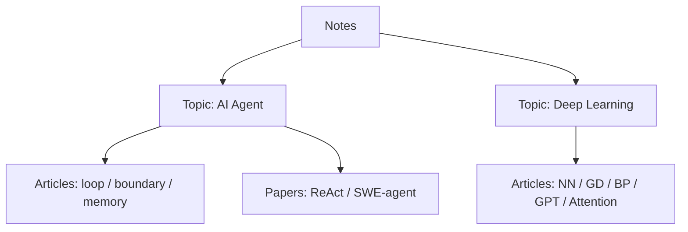

# 快速开始：如何读这些笔记

这里的笔记按 topic 组织。topic 是一条长期主线，article 是主线里的一个概念页，paper 是围绕某篇论文的阅读记录。

## 第一步：先选 topic

如果你关心模型如何行动，读 [AI Agent](ai-agent/index.md)。如果你关心模型为什么能训练、Transformer 为什么有效，读 [Deep Learning](deep-learning/index.md)。

## 第二步：先读出问题

只读标题、摘要、引言、图表标题和结论。目标是能回答四件事：

- 论文要解决的问题是什么。
- 方法叫什么。
- 和已有做法的差异在哪里。
- 是否值得进入第二遍。

对 ReAct 来说，第一遍只要抓住：它把 reasoning 和 acting 交替放进同一条轨迹。

对 SWE-agent 来说，第一遍只要抓住：它把接口设计当成 coding agent 的核心变量。

对反向传播来说，第一遍只要抓住：它不是“学习本身”，而是高效计算梯度的方法。

## 第三步：抓住方法和证据

这一遍读方法、关键图、实验设置和主要结果。先不纠结所有附录，目标是讲清楚论文的主张和证据链。

| 论文 | 第二遍重点 |
| --- | --- |
| ReAct | Thought、Action、Observation 如何互相影响；为什么它能缓解 CoT 的幻觉和 Act-only 的无计划。 |
| SWE-agent | ACI 如何改变动作空间、反馈格式和上下文噪音；为什么 shell-only 不够。 |
| Deep Learning articles | 一张图、一个 PyTorch-like 伪代码、一个核心张量形状。 |

## 第四步：回到代码和失败模式

第三遍才看 prompt、环境 wrapper、ACI 配置、action parser、edit guardrails、测试执行和 submit 逻辑。

这时应该带着问题看代码，而不是把代码当成流水账读。例如：

- 这个接口减少了哪种模型错误？
- 这个反馈是否真的帮助下一轮决策？
- 如果换模型 provider，哪些机制应该保留？

## 复习输出

每次读完一篇，不急着写完整摘要，只写三类内容：

- 一句话贡献。
- 一个关键机制。
- 一个失败模式或边界。

## 下一步

| 如果你已经能说清... | 下一篇 |
| --- | --- |
| agent 为什么不是一次性问答 | [AI Agent Topic](ai-agent/index.md) |
| ReAct 为什么需要环境反馈 | [SWE-agent](papers/swe-agent.md) |
| 换模型时不能乱动 agent loop | [实现与 provider 边界](topics/implementation-boundaries.md) |
| memory 不是把所有历史塞进 prompt | [长期记忆](topics/long-term-memory.md) |
| 神经网络为什么能通过数据调整参数 | [Deep Learning Topic](deep-learning/index.md) |

如果你想先补深度学习基础，按这个顺序读：

1. [神经网络的结构](deep-learning/neural-network-structure.md)
2. [梯度下降法](deep-learning/gradient-descent.md)
3. [反向传播算法](deep-learning/backpropagation.md)
4. [GPT 是什么？直观讲解 Transformer](deep-learning/gpt-transformer.md)
5. [直观解释注意力机制，Transformer 的核心](deep-learning/attention.md)
